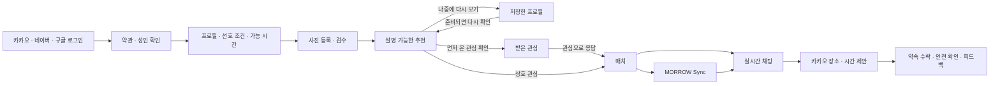
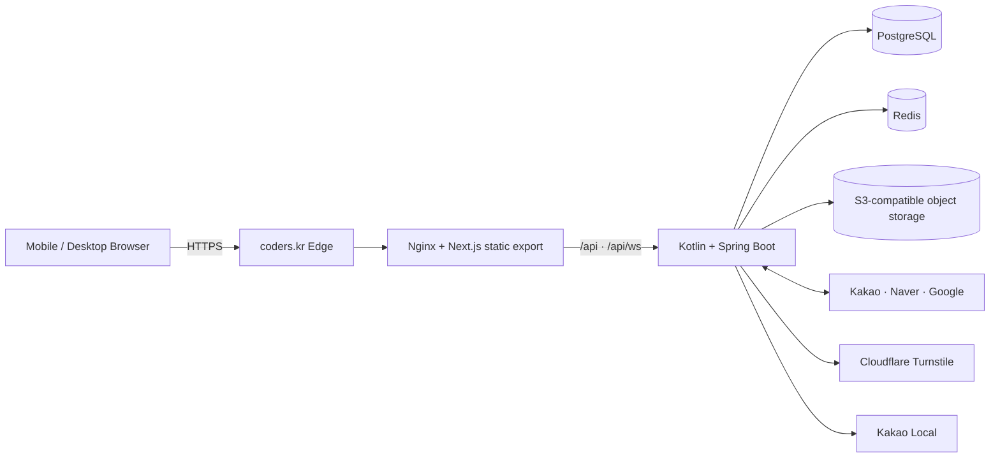

<p align="center">
  
</p>

<h1 align="center">MORROW</h1>

<p align="center">
  좋아요 수가 아니라 <strong>안전한 대화와 실제 약속의 성사</strong>를 설계하는<br />
  만 20세 이상 소셜 디스커버리·소개팅 웹 서비스
</p>

<p align="center">
  <a href="https://morrow.coders.kr"><strong>서비스 열기</strong></a>
  · <a href="./release/LAUNCH_CHECKLIST.md">출시 체크리스트</a>
  · <a href="./release/MONETIZATION_ROADMAP.md">수익화 로드맵</a>
  · <a href="./release/PRODUCT_PLAN.md">제품 고도화 기획</a>
  · <a href="./release/SCALE_READINESS.md">10만+ 운영 준비 기준</a>
  · <a href="./backend/.env.example">환경 변수 예시</a>
</p>

> 프로덕션은 가상 회원·가상 매치·가상 메시지를 생성하지 않습니다. 추천과 대화에 표시되는 정보는 실제 가입자가 직접 등록한 데이터만 사용합니다.

프로덕션 URL: <https://morrow.coders.kr> · 현재 상태: **READY** (2026-09-15 고도화 릴리스 검증)

## 랜딩 페이지 방향

첫 화면에서 서비스의 약속을 이해하고 바로 시작할 수 있도록, 소개팅 신청형 랜딩의 흐름을 MORROW의 실제 기능에 맞게 구성했습니다.

- 히어로: `약속이 먼저`라는 가치 제안과 취향 입력 CTA
- 발견: 시간·동네·데이트 분위기 선택 → 로그인 후 실제 회원 추천
- 과정: 만남 조건 입력 → 추천 → 3분 Sync → 앱 안에서 약속
- 신뢰: 사진 검수, 연락처 비공개, 차단·신고·공개 장소 약속 안내
- 반응형: 모바일 360px부터 데스크톱까지 동일한 정보 우선순위와 터치 타깃

### 전국 활동 지역

활동 지역은 서울 일부 동네에 한정하지 않습니다. `전국`을 포함해 서울 25개
구, 6대 광역시·세종의 주요 구, 경기 주요 도시, 강원·충청·전라·경상·제주의
시·군 중심지를 선택할 수 있습니다. 기존 `성수`, `연남` 같은 동네 단축값도
기존 프로필과의 호환을 위해 계속 지원합니다. `전국`을 선택하면 정확한 집 주소를
저장하지 않고 지역 필터와 근사 거리 제한을 완화해 전국 회원을 탐색합니다.

지역 선택을 넓혀도 만 20세 이상 확인, 필수 동의, 상호 선호, 차단·신고·사진
검수, 요청 속도 제한과 계정 제재는 해제하지 않습니다. 이는 공개 홍보로 유입된
신규 회원이 많아질 때 개인정보와 서비스 안정성을 지키기 위한 필수 운영 장치입니다.

랜딩에 사용한 사진은 서비스 분위기를 표현하는 연출 이미지이며, 실제 회원처럼 보이는 이름·수치·후기를 만들지 않습니다. 실제 프로필과 매칭 결과는 로그인·동의·검수 이후 서버의 실데이터로만 표시됩니다.

### SEED 원칙을 적용한 UI 고도화

프론트는 SEED의 공개 가이드에서 제시하는 역할 기반 색상, 모바일 우선 레이아웃,
일관된 간격·타이포그래피·상태 표현을 MORROW 브랜드 언어로 재해석했습니다.
버튼의 pressed 피드백, 키보드 focus ring, 안전·성공·오류 상태를 같은 토큰 체계로
관리하고, 추천 카드에는 `왜 추천됐나요?` 펼침 영역을 추가해 시간·공통 관심사·추천
근거를 실제 데이터로 확인할 수 있습니다. 약속 제안·응답·안전 확인·만남 피드백은
브라우저 alert 대신 화면 안의 상태 메시지로 전달해 모바일에서도 흐름이 끊기지 않습니다.

- [SEED Foundations](https://seed-design.io/foundations)
- [SEED React 구현 인덱스](https://seed-design.io/react/llms.txt)
- [디자인 시스템에도 브랜딩이 필요할까](https://seed-design.io/updates/why-design-system-needs-branding)

## 왜 MORROW인가

대부분의 소개팅 서비스는 프로필을 계속 넘기게 만드는 데 집중합니다. MORROW는 상호 관심 이후 사용자가 멈추는 지점을 제품의 시작점으로 봅니다.

1. 서로 관심을 표현한 사람만 연결합니다.
2. `MORROW Sync`에서 같은 질문에 답하고, 두 답변이 모두 제출된 뒤 동시에 공개합니다.
3. 연락처를 먼저 공개하지 않고 서비스 안에서 대화·장소·시간을 정합니다.
4. 약속 전후 안전 확인과 피드백을 신뢰 흐름에 반영합니다.
5. 차단·신고·사진 검수·계정 제재를 운영 콘솔까지 이어 줍니다.

## 수익화 전 단계 운영 원칙

수익화는 최종 목표지만, 초기부터 결제벽을 세우지 않습니다. 먼저 실제 회원이
안전하게 둘러보고 다시 방문할 이유를 만들고, 그 행동이 충분히 쌓인 뒤에만
선택형 유료 가치를 검증합니다.

1. **핵심 경험은 무료**: 추천, 기본 관심 보내기, 상호 매치, 채팅, MORROW Sync,
   약속 제안, 안전 기능을 유료 잠금 없이 제공합니다.
2. **재방문 루프**: 마음에 둔 프로필을 최대 50명까지 `나중에 다시 보기`에 저장하고,
   다음 방문에 실제 회원 데이터를 다시 확인할 수 있습니다. 저장 목록은 결제 없이
   제공하며 저장·재방문·관심 전환을 측정할 수 있는 제품 지표 기준으로 삼습니다.
3. **신뢰 지표 우선**: 프로필 완성률, 첫 대화 응답률, 약속 제안률, 안전 피드백과
   신고 처리 시간을 먼저 개선합니다. 안전·본인확인·신고를 수익화 수단으로 사용하지 않습니다.
4. **검증 후 선택형 확장**: 유지율과 매치 품질이 확인된 뒤 큐레이션 지원, 고급
   탐색 도구처럼 운영 원가가 분명한 부가 가치만 실험합니다. 가격·결제·구독은
   아직 구현하지 않았고, 사용자의 기본 대화와 안전을 제한하지 않는 방향으로 검토합니다.

현재 구현은 1~2단계까지이며 결제 API나 실제 과금은 연결되어 있지 않습니다.
향후 실험은 별도 기능 플래그와 명확한 고지 아래 진행하고, 무료 핵심 흐름의
전환율·이탈률·신고율을 함께 비교해 결정합니다.

세부 지표와 과금 도입 게이트는 [`release/MONETIZATION_ROADMAP.md`](./release/MONETIZATION_ROADMAP.md)에서 관리합니다.

## 10만+ 회원 운영 준비

매치 목록의 N+1 조회 제거, 메시지·알림 핫패스 인덱스, Redis 공유 속도 제한,
Redis 장애 시 메모리 폴백 정리, PostgreSQL·Redis readiness 엔드포인트를 포함한
확장성 가드레일을 적용했습니다. 합성 데이터 기반 부하 시나리오와 점진 공개·복구
게이트는 [`release/SCALE_READINESS.md`](./release/SCALE_READINESS.md)에 정리되어
있으며, 운영 URL의 비파괴 자가진단은 다음 명령으로 반복 실행할 수 있습니다.

```powershell
pwsh ./release/self-test.ps1 -BaseUrl https://morrow.coders.kr -DurationMinutes 5
```

자가진단은 서비스 생존·DB·Redis·OAuth 제공자와 보호 API의 익명 접근 차단만
확인합니다. 10만 명 수용 판정은 별도 스테이징에서 익명화 합성 계정으로 승인된
부하·복구 테스트를 통과해야 합니다.

## 핵심 사용자 흐름



`MORROW Pulse`는 추천, 첫 대화, 읽지 않은 메시지, 약속 상태를 보고 현재 사용자에게 필요한 다음 행동 하나만 제안합니다. 이 상태 역시 서버의 실제 데이터로만 계산합니다.

## 구현 범위

| 영역 | 사용자 기능 | 서버 보장 |
| --- | --- | --- |
| 로그인 | 카카오·네이버·구글 OAuth | `state`, Google PKCE·nonce, 일회성 흐름, 안전한 내부 복귀 경로, 해시 세션, Turnstile 준비·만료·실패·재시도 상태 |
| 온보딩 | 필수 동의, 만 20세 확인, 전국 활동 지역·프로필·관심사·가능 시간 | Bean Validation, 전국 지역 카탈로그·선택지·길이 검증, 동의 버전 기록 |
| 추천 | 전국 지역·연령·거리·성별·활동 상태 필터, 추천 이유 | 상호 선호 조건, `전국` 선택 시 지역·근사 거리 완화, 차단·스와이프·노출 제외, 조회 인덱스 |
| 재방문 | 프로필 저장, 저장 목록에서 다시 보기·삭제 | 사용자-프로필 유일성, 최대 50개 제한, 차단·비활성 회원 재노출 방지 |
| 받은 관심 | 먼저 관심을 보낸 실제 회원 확인, 관심 보내기·패스·상세 보기 | 차단·비활성·불완전·기존 매치·이미 응답한 계정 쿼리 제외, 수신 전용 인덱스 |
| 사진 | 최대 6장, 순서·공개 범위 | 매직 바이트·크기·SHA-256 검증, 객체 저장소, 검수 전 비공개 |
| 매칭 | 관심·패스, 상호 관심 매치 | 트랜잭션, 비관적 잠금, 사용자 쌍 유일성 |
| Sync | 3라운드 아이스브레이커 | 양쪽 제출 전 비공개, 행 잠금, 라운드별 중복 방지 |
| 채팅 | 매칭 후 1:1 텍스트·사진 메시지, 프로필 사진 갤러리, 읽음·입력 중·재연결·전송 실패 재시도 | WebSocket 인증, 사용자별 분당 메시지 예산, DB 선저장, `client_id` 멱등성, 이미지 매직바이트·크기 검증, 매칭 당사자만 미디어 열람 |
| 약속 | 날짜·시간·장소 제안, 수락·거절 | 매치 당사자 권한, URL·좌표·상태 전이 검증 |
| 안전 | 차단·신고·대화 종료·약속 안전 확인 | 차단 즉시 노출 분리, 신고 큐, 신뢰 피드백 |
| 운영 | 사진·신고·본인확인 검수, 정지·복구 | 운영자 UUID 검사, 모든 조치 감사 로그 |
| 계정 | 알림 설정, 노출 중지, 데이터 내보내기, 탈퇴 | 세션·관계·미디어를 포함한 계정 수명주기 |

## 시스템 아키텍처



- Next.js는 정적 결과물만 생성하고 Nginx가 모바일·데스크톱 공용 UI를 전달합니다.
- Spring Security가 HTTP와 WebSocket의 동일한 세션을 검증합니다.
- JPA 트랜잭션과 PostgreSQL 제약 조건이 중복 매치·답변·메시지를 최종 방어합니다.
- Redis는 여러 API 인스턴스가 공유하는 요청 제한 카운터로 사용하며, 장애 시 인스턴스 로컬 제한으로 축소 동작합니다.
- 사진 원본은 객체 저장소에 두고, 인증된 사진 API가 소유권·차단·검수 상태를 매번 확인합니다.
- Flyway는 새 데이터베이스를 자동 구성하고, 기존 Alembic 0001~0009 데이터베이스는 baseline 9로 안전하게 인수합니다.

## 기술 스택

| 계층 | 기술 |
| --- | --- |
| UI | React 19.2, Next.js 16.2 App Router, TypeScript 5, Tailwind CSS 4, Base UI |
| API | Kotlin 2.3.21, Spring Boot 4.1.1, Spring MVC, Spring Security, Bean Validation |
| Data | Spring Data JPA, Hibernate ORM 7, PostgreSQL 16, Flyway |
| Realtime | Spring WebSocket, DB-backed message history |
| Traffic | Nginx edge cache, Redis distributed rate limit, HikariCP, stateless HTTP sessions |
| Media | AWS SDK for Java 2.x S3 client, managed object storage |
| Runtime | Java 21 bytecode, Java 25 LTS container, Gradle 9.7.1, Docker multi-stage build |
| Quality | JUnit 6 platform, Spring Boot context test, Kotlin validation tests, ESLint, Next production build |

Kotlin은 Spring Initializr가 Spring Boot 4.1.1과 함께 제공하는 호환 버전을 사용합니다. 애플리케이션 바이트코드는 로컬·CI 호환성을 위해 Java 21로 만들고, 운영 이미지는 Java 25 LTS VM에서 실행합니다.

## API 설계

주요 경로는 기존 React 클라이언트 계약을 유지하므로 서버 전환 뒤에도 UI를 다시 작성할 필요가 없습니다.

```text
/api/health/live                    프로세스 생존 확인
/api/health/ready                   PostgreSQL·Redis readiness 확인
/api/auth/{provider}/start|callback   OAuth 시작·콜백
/api/me                              내 계정과 프로필
/api/discover                        추천 목록
/api/saved-profiles                  나중에 다시 볼 프로필 저장·목록·삭제
/api/interests/received              나에게 먼저 온 관심 목록·응답
/api/swipes                          관심·패스
/api/matches/{id}/messages           메시지 이력·전송 (`before` 커서로 이전 기록 페이지)
/api/messages/{id}/media             매칭 당사자 전용 채팅 사진
/api/ws/matches/{id}                 매치 실시간 채널
/api/ws/inbox                        받은편지함 실시간 채널
/api/matches/{id}/sync               MORROW Sync
/api/matches/{id}/plans              약속 제안
/api/places                          카카오 장소 검색
/api/profile/photos                  프로필 사진
/api/reports · /api/blocks           신고·차단
/api/admin/*                         운영 검수
/api/account/export|delete           내보내기·영구 삭제
```

오류 응답은 `{ "detail": "사용자에게 보여줄 설명" }` 형식으로 통일합니다. 인증이 필요한 경로는 `401`, 권한 위반은 `403`, 중복 상태는 `409`, 검증 실패는 `422`, 요청 제한은 `429`를 반환합니다.

로그인 화면의 Turnstile 위젯은 스크립트가 실제로 로드된 뒤에만 렌더링합니다. 토큰이 준비되기 전에는 OAuth 버튼을 잠그고, 만료·타임아웃·클라이언트 오류에는 재시도 UI를 표시합니다. 운영 환경에서는 Cloudflare Turnstile의 허용 hostname에 `morrow.coders.kr`를 등록하고 `TURNSTILE_SITE_KEY`와 `TURNSTILE_SECRET_KEY`가 같은 위젯 쌍인지 확인해야 합니다.

## 로컬 실행

### 가장 빠른 방법

요구 사항은 Docker Desktop과 Docker Compose입니다.

```bash
docker compose up --build
```

| 서비스 | 주소 |
| --- | --- |
| React Web | http://localhost:3000 |
| Spring API | http://localhost:8000 |
| PostgreSQL | localhost:5432 |

`DEV_FAKE_USER`는 로컬 개발 편의를 위한 UUID이며 프로덕션에는 설정하지 않습니다. 가상 추천 데이터가 아니라, 로컬에서 요청 주체만 고정하는 개발용 인증 장치입니다.

### 개별 실행

```bash
# API — Java 21+
cd backend
./gradlew bootRun

# UI — Node.js 22 + pnpm 9
cd frontend
pnpm install --frozen-lockfile
pnpm dev
```

Windows에서는 `./gradlew` 대신 `gradlew.bat`를 사용합니다.

## 환경 변수

전체 예시는 [`backend/.env.example`](./backend/.env.example)에 있습니다. 실제 Secret은 Git에 커밋하지 않고 배포 환경에서 주입합니다.

| 그룹 | 변수 |
| --- | --- |
| DB | `DATABASE_URL`, `DATABASE_USER`, `DATABASE_PASSWORD` |
| 앱 | `PUBLIC_APP_URL`, `AUTH_MODE`, `SESSION_COOKIE_NAME`, `SESSION_DAYS` |
| OAuth | `KAKAO_*`, `NAVER_*`, `GOOGLE_*` |
| 봇 방지·지도 | `TURNSTILE_SITE_KEY`, `TURNSTILE_SECRET_KEY`, `KAKAO_MAP_REST_KEY`, `NEXT_PUBLIC_KAKAO_MAP_JS_KEY` |
| 트래픽·미디어 | `REDIS_URL`, `STORAGE_*` |
| 운영 | `ADMIN_CODERS_IDS` |

프로덕션 콜백 주소:

```text
https://morrow.coders.kr/api/auth/kakao/callback
https://morrow.coders.kr/api/auth/naver/callback
https://morrow.coders.kr/api/auth/google/callback
```

## 품질 검증

```bash
# Kotlin API: 컴파일 + 계약 테스트 + 전체 Spring 컨텍스트
cd backend
./gradlew test
./gradlew bootJar

# React UI: 코드 품질 + TypeScript + 정적 페이지 생성
cd frontend
pnpm lint
pnpm build
```

서버 테스트는 프로필 검증, 만 20세 제한, OAuth 오픈 리다이렉트 방지, 세션 SHA-256, Security/JPA/WebSocket/Controller 통합 기동을 확인합니다. 프로덕션 빌드 전 과정에서는 TypeScript 검사와 모든 정적 페이지 생성을 함께 수행합니다. 채팅 사진은 매칭된 상대만 인증 쿠키로 읽을 수 있으며, 전화번호·카카오톡 아이디를 자동 공개하지 않습니다.

## 보안·트래픽 원칙

- 비밀번호와 OAuth 원문 토큰을 보관하지 않습니다.
- 세션 토큰은 SHA-256 해시만 저장하고 쿠키는 `HttpOnly`, `Secure`, `SameSite=Lax`로 발급합니다.
- 쓰기 요청은 실제 서비스 Origin을 확인하고 본문 크기를 제한합니다.
- 읽기와 쓰기 요청을 분리해 Redis 기반 분당 제한을 적용합니다.
- 추천과 사진 API는 차단 관계·계정 상태·검수 상태를 서버에서 다시 확인합니다.
- DB 유일성 제약과 트랜잭션 잠금은 여러 요청이 동시에 도착해도 한 번만 처리되게 합니다.
- 모든 응답에 요청 ID와 기본 보안 헤더를 추가하며, 상태 API와 Actuator probe를 분리합니다.

## 배포

[`coders.yaml`](./coders.yaml)은 Web, API, PostgreSQL, Redis, 객체 저장소를 하나의 공개 서비스로 선언합니다.

저장소 기준은 다음과 같습니다.

- canonical upstream: <https://github.com/boclair98/morrow>
- organization fork: <https://github.com/coders-kr/morrow>
- Coders.kr deployment source: canonical upstream `main`

조직 저장소는 canonical 저장소의 실제 GitHub fork이며, 업데이트 시 upstream을 먼저 push한 뒤 fork를 동기화합니다.

```text
frontend/Dockerfile  → Next.js static export → Nginx
backend/Dockerfile   → Gradle build → non-root Java 25 runtime
```

배포 뒤 다음 경로를 확인합니다.

```text
GET /api/health/live   프로세스·런타임 확인
GET /api/health        PostgreSQL 포함 준비 상태
GET /api/auth/providers OAuth·Turnstile·지도 공개 설정 확인
```

스키마 변경은 `src/main/resources/db/migration`에 순방향 Flyway 파일로 추가합니다. 기존 운영 데이터베이스는 자동 baseline 이후 보존되며, 운영에서 Hibernate 자동 DDL은 사용하지 않습니다.

## 저장소 구조

```text
.
├─ backend/
│  ├─ src/main/kotlin/kr/morrow/api/
│  │  ├─ config/       # security, traffic safety, WebSocket
│  │  ├─ domain/       # JPA entities
│  │  ├─ repository/   # Spring Data repositories
│  │  ├─ service/      # auth, matching, chat, media, account
│  │  └─ web/          # REST controllers and DTOs
│  ├─ src/main/resources/db/migration/
│  └─ src/test/kotlin/
├─ frontend/
│  ├─ app/             # App Router pages and legal pages
│  ├─ components/      # responsive product UI
│  ├─ lib/             # typed API and realtime clients
│  └─ public/          # optimized service imagery
├─ release/            # launch and load-test assets
├─ compose.yaml        # local full stack
└─ coders.yaml         # production manifest
```

이전 Python/FastAPI 파일과 Alembic 이력은 운영 데이터 호환성을 확인하기 위한 전환 기록으로 남아 있습니다. 현재 Docker 이미지와 실제 API 런타임은 Kotlin/Spring Boot 소스만 빌드합니다.

## 공개 출시 전 마지막 확인

기능 코드가 준비된 것과 무제한 공개 모집이 가능한 것은 다릅니다. 실제 서비스 출시 전에는 아래 운영 조건이 반드시 필요합니다.

- 사업자·개인정보 보호책임자·고객지원 연락처를 약관과 개인정보 처리방침에 반영
- 실제 계정 2개로 OAuth → 매치 → 채팅 → 약속 → 신고 전체 왕복 테스트
- 전문 본인·성인 인증 연동 또는 검수 인력과 처리 SLA 확정
- 신고 대응 담당자, 백업 복구 시험, 장애 알림, 개인정보 삭제 점검
- 수평 확장 시 WebSocket 인스턴스 간 fan-out 브로커와 푸시 알림 추가

세부 기준은 [`release/LAUNCH_CHECKLIST.md`](./release/LAUNCH_CHECKLIST.md)에서 관리합니다.

